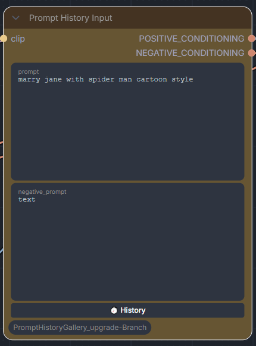
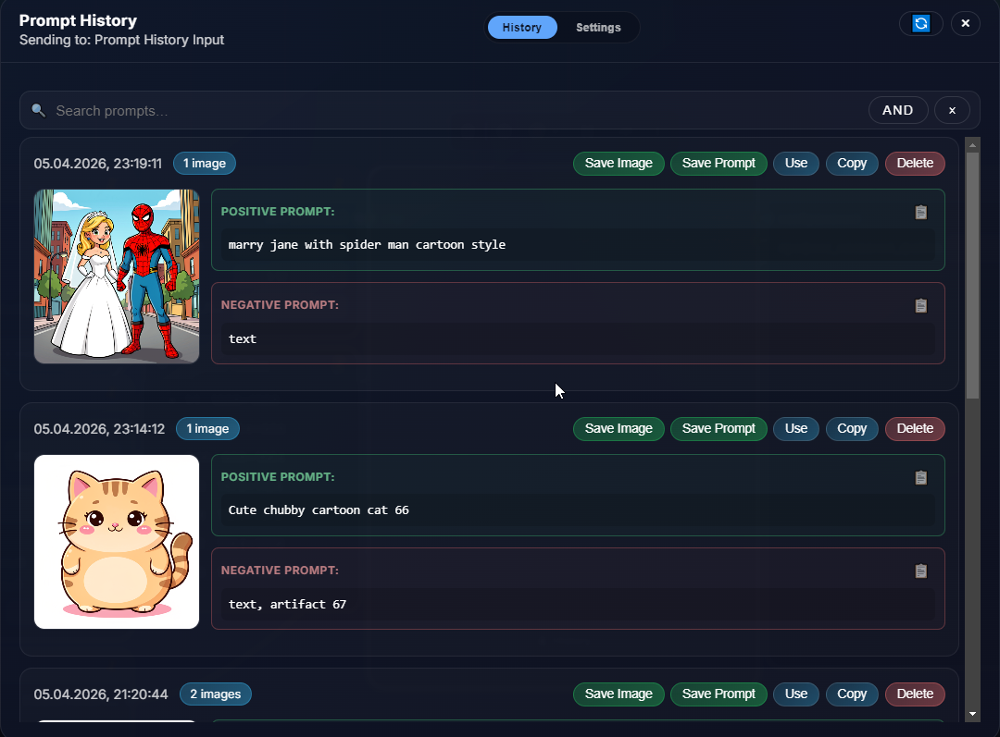
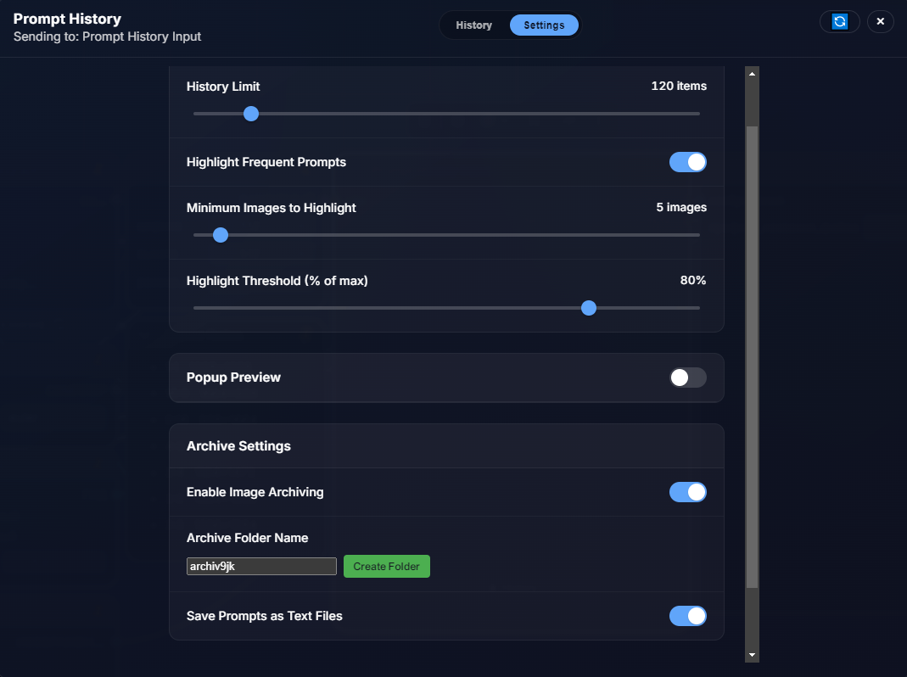
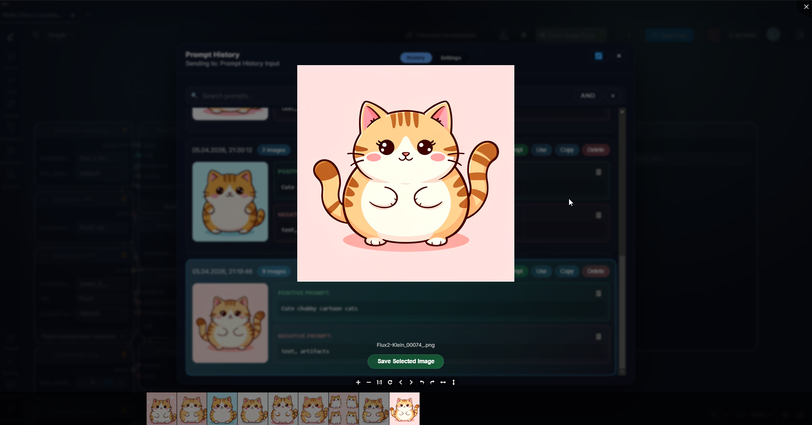

# ComfyUI-PromptHistoryGallery

Capture ComfyUI prompts and generated images with a history dialog, popup previews, and a full gallery viewer.

## Features

- **Dual Prompt Support**: Separate positive and negative prompt fields, both saved to history independently
- **Flexible Copy Options**: Copy positive prompt, negative prompt, or both together with 📋 or Copy buttons
- **Save Prompts as Text**: Export prompts directly to .txt files
- **Save Images from History**: Download images directly from the history panel for easy organization
- **Gallery Image Save**: Save selected images directly from the gallery viewer
- **Image Archiving**: Prevent broken paths by automatically archiving generated images to a dedicated folder
- **Auto-save Prompts**: Automatically save prompt text files alongside generated images
- **Smart History Management**: View latest thumbnails, image counts, and jump straight into the gallery
- **Search & Filter**: Search history by prompt text or tags with quick actions (send to node, copy, delete)
- **Popup Previews**: See previews when generations finish; click to open the full gallery
- **Customizable Settings**: Tune history limit, frequent-prompt highlighting, and popup preview options

## Prompt History Input Node

 

- `CLIP`: Connect the CLIP text encoder that should be used to embed the prompts.
- `prompt`: Provide your positive text prompt. Saved to history and returns matching `CONDITIONING`.
- `negative_prompt`: Provide your negative text prompt. Also saved to history separately.

**Outputs:**

- `POSITIVE_CONDITIONING`: The `CONDITIONING` tensor produced by encoding the positive prompt with the supplied CLIP model.
- `NEGATIVE_CONDITIONING`: The `CONDITIONING` tensor produced by encoding the negative prompt with the supplied CLIP model.

The node executes on every graph run so repeated prompts are captured. Each execution appends or touches an entry in a SQLite database (default: `prompt_history_gallery/data/prompt_history.db`). Set the `COMFYUI_PROMPT_HISTORY_DIR` environment variable to override the storage location.

## History Dialog

 

- Each `Prompt History Input` node includes a `History` button. Clicking it opens a dialog with recent prompts grouped by text and sorted by recent use.
- **Dual Prompt Display**: Both positive and negative prompts are shown separately for each entry.
- **Smart Copy Buttons**: 
  - 📋 icon next to each prompt field to copy individually
  - `Copy` button to copy both prompts together
- **Save Options**:
  - `Save Prompt`: Export prompts to .txt file
  - `Save Image`: Download the generated image directly
  - `Use`: Send prompt back to the selected node
  - `Delete`: Remove entry from history
- Search by prompt text or tags. Entries show the latest preview, image count, and tags when available.
- The dialog refreshes when new prompts finish so it stays in sync with the latest generations.

## Settings

### History Settings
- **History Limit**: Maximum number of items to keep in history (default: 120 items)
- **Highlight Frequent Prompts**: Toggle to highlight commonly used prompts
- **Minimum Images to Highlight**: Set threshold for frequent prompt highlighting (default: 5 images)
- **Highlight Threshold (% of max)**: Percentage threshold for highlighting (default: 80%)
- **Popup Preview**: Enable/disable popup previews when generations complete

### Archive Settings
- **Enable Image Archiving**: Toggle to automatically archive all generated images to prevent broken paths
  - When enabled, images are saved to both their normal output location AND the archive folder
  - Files are linked to the database from the archive location
  - Moving or deleting original files won't break history entries
- **Archive Folder Name**: Specify the folder name for archived images (default: `archiv9jk`)
  - Click `Create Folder` to initialize the archive directory
- **Save Prompts as Text Files**: Toggle to automatically save prompt .txt files alongside generated images
  - Files are named to match their corresponding images
  - Provides backup and easy reference even outside ComfyUI

## Gallery Viewer

 

- Click any preview in the history dialog to open the full gallery viewer
- Browse all images associated with a prompt
- **Save Selected Image**: Use the `Save Selected Image` button to download the currently displayed image
- Navigate through multiple images with thumbnail strip at the bottom
- Zoom and pan controls for detailed inspection

## Database Notes

⚠️ **Important**: The database schema has been updated to support:
- Separate positive and negative prompt storage
- Image archiving paths
- Auto-saved prompt file tracking
- Enhanced metadata

**Backward Compatibility**: Due to significant schema changes, backward compatibility with previous database versions is not guaranteed. If you're upgrading from an older version, consider exporting your data first or starting with a fresh database.

## Development

### Formatting

- One-shot fixer: `scripts/format.sh` (needs `pipx` and Node) runs Ruff via `pipx run --spec ruff==0.14.10` plus Prettier `-w` to apply fixes.
- Install dev tools: `pip install -e .[dev]` (provides Ruff).
- Python: run `ruff format --check .` and `ruff check --select I .` (add `--fix` locally if you want auto-fixes).
- Web/JS/CSS: run `npx prettier@3.7.4 --check "web/**/*.{js,jsx,ts,tsx,css,scss,html,json}"` (honors `.prettierignore`; `web/vendor/` is excluded).
- CI: `.github/workflows/ci.yml` runs `ruff format --check .`, `ruff check --select I .`, and `npx prettier@3.7.4 --check "web/**/*.{js,jsx,ts,tsx,css,scss,html,json}"` on pushes/PRs to `main`.

### Release

- Release bundles are published by GitHub Actions; no manual `node.zip` rebuild is required.

## Credits

This is a fork of [ComfyUI-PromptHistoryGallery](https://github.com/x0x0b/ComfyUI-PromptHistoryGallery) with significant enhancements including dual prompt support, image archiving, and enhanced save capabilities.
